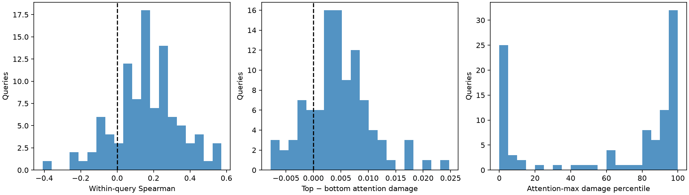

# Attention Faithfulness：Intervention Audit

人工查看记录：[三类案例与可视化检查](VISUAL_AUDIT.md)。复现时请将 `--output-dir` 改为新的空目录，以保留本次结果。

**attention is useful for targeted occlusion globally, but is not sufficiently faithful as a local vulnerability estimator**

## 固定 protocol

同一 checkpoint、MSLS 验证集和保存的 query 顺序前 100 个；完整 reference database 共 18871 张，仅复用缓存，没有重算 reference。
真实 backbone token grid 动态生成 2×2 windows，stride=1。token mask → nearest upsample → RGB [0,1] mean-fill → ImageNet Normalize → frozen model → full-database retrieval。
Mean fill=image_mean；variant batch_size=32，共 48400 windows、1600 次 batched variant forward。
Attention score 是每个 window 内 raw aggregated attention 的均值；聚合仍为 mean heads → mean queries → mean layers，未增加权重。margin_drop = clean margin − deleted margin，保留负数。Attention Proposal Map 没有改名为 causal map。

## Query-level faithfulness

独立单位是 query。每个 query 单独计算 Spearman，未将 windows 汇总为独立样本，也未报告 window-level p-value。有效相关 query=100，常量导致未定义=0。相关统计及 positive fraction 以有效相关 query 为分母；top/bottom 和 percentile 统计使用全部 query。
固定 seed=2024，20,000 次 query-level percentile bootstrap；表中区间均为逐项 95% CI，不是 simultaneous CI。重采样同时保留同一 query 的 top/bottom 配对。

| Endpoint | Estimate [95% CI] |
| --- | --- |
| Mean Spearman | 0.162279 [0.126870, 0.197289] |
| Median Spearman | 0.165547 [0.137114, 0.196605] |
| Positive-correlation query fraction | 0.830000 [0.750000, 0.900000] |
| Mean top − bottom attention-window damage | 0.004647 [0.003535, 0.005794] |
| Median top − bottom damage | 0.004248 [0.003392, 0.005215] |
| Mean attention-max damage percentile | 61.919255 [53.741149, 69.942288] |
| Median attention-max damage percentile | 84.368530 [71.118012, 92.132505] |

Across-query mean top damage=0.004651；mean bottom damage=0.000004。
Top/bottom 分别取 K=max(1, round(0.1×window_count)) 个 windows。按 raw attention 排序，ties 按 row-major 坐标；同一 query 先求两组 mean damage 的差再 bootstrap。attention-max 遇到 ties 选 row-major 第一个，同时保存 ties 数量。Deletion-damage percentile = 100×(ascending average rank − 1)/(N − 1)，100 表示 damage 最高，0 最低。

## 解释边界

描述性判断规则：mean Spearman ≥ 0.3、mean Spearman CI 下界 > 0、top−bottom damage CI 下界 > 0，且相关均可定义时，称为 useful proposal signal。该可配置强度阈值用于描述结果，不是通用标准或预注册阈值。即使通过，也不能据此声称 attention 是精确或校准过的局部 sensitivity estimator。
该结果只针对当前模型、mean-fill、窗口尺度和样本。重叠 windows 相互依赖，不能用于扩充统计样本数；相邻 query 的路线相关性未作 cluster 校正。本步骤不训练、不 fusion，不扩展到后续阶段。

## 可视化与案例

所有 query 的 raw attention、window attention、signed window damage、坐标和 overlap counts 保存于 maps/*.npz。overview / cases 图包含 attention map、以 0 为中心的 signed deletion sensitivity、两种 overlay 和 scatter。Deletion overlay 是覆盖该 token 的 windows 的平均 damage，仅供显示，不是单 token effect，也不用于统计。
三类案例按 query 内 attention / damage 上下 20% 划分；strong intervention 额外要求 damage > 0。固定 seed，先在每个合格 query 内随机取一个合格 window，再对 query 做 reservoir sampling。案例只用于人工检查，不能替代全体 query-level 结果；绿色框和散点星号标记被选 window。

| Category | Eligible queries | Qualifying windows | Saved cases |
| --- | --- | --- | --- |
| attention_strong_intervention_strong | 100 | 4658 | 3 |
| attention_strong_intervention_weak | 100 | 2793 | 3 |
| attention_weak_intervention_strong | 53 | 211 | 3 |

解释修订：初版阈值 0.10 会把稳定但弱的相关直接归为 useful proposal。观察完整结果后，按用户要求区分正向 proposal 信息与局部 faithfulness，描述性阈值改为 0.30。这是透明的事后解释选择，不能作为预注册检验；原始阈值与源码哈希保存在 config.yaml。两种阈值下 Spearman、top−bottom、CI 和 percentile 完全相同，仅结论措辞改变；没有重跑模型。positive_proposal_signal_supported 仍为 true，表示稳定正向关联，不代表局部估计精度足够。



## 复现与验证

模型 / checkpoint / reference manifest 与原实验 identity 严格核对，cache SHA-256 在前后验证未改变。每个 clean query 的 rank 与 margin 与原实验 CSV 对照，结果写入 per_query.csv。完整运行配置、输入哈希和精度设置见 config.yaml。

```bash
python scripts/eval_intervention_probe.py --source-config outputs/stage1/ablation500/config.yaml --output-dir outputs/stage1/intervention100 --num-queries 100 --batch-size 32 --bootstrap-samples 20000 --window-size 2 --stride 1 --tail-fraction 0.1 --min-mean-spearman 0.3 --cases-per-category 3
```
