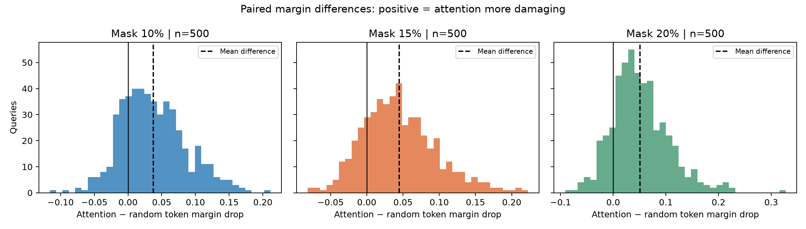
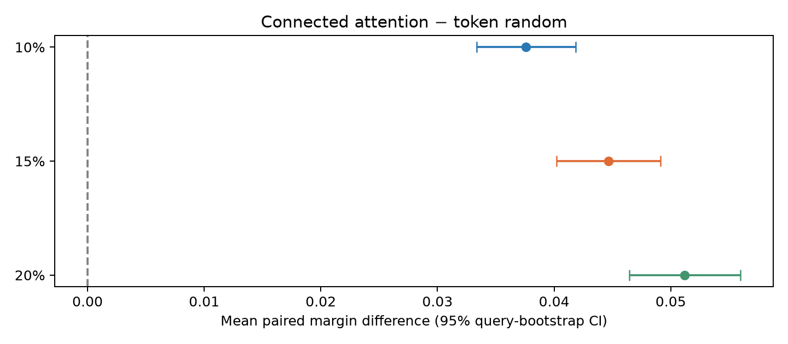
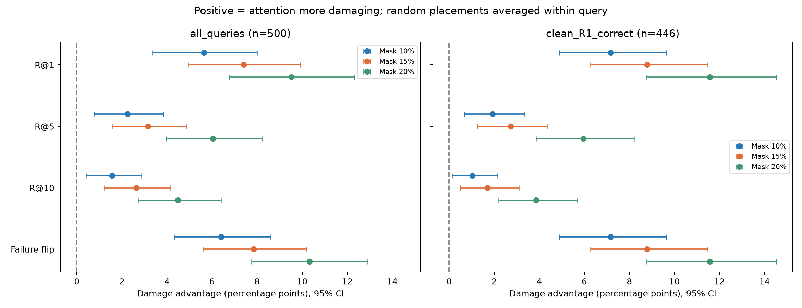
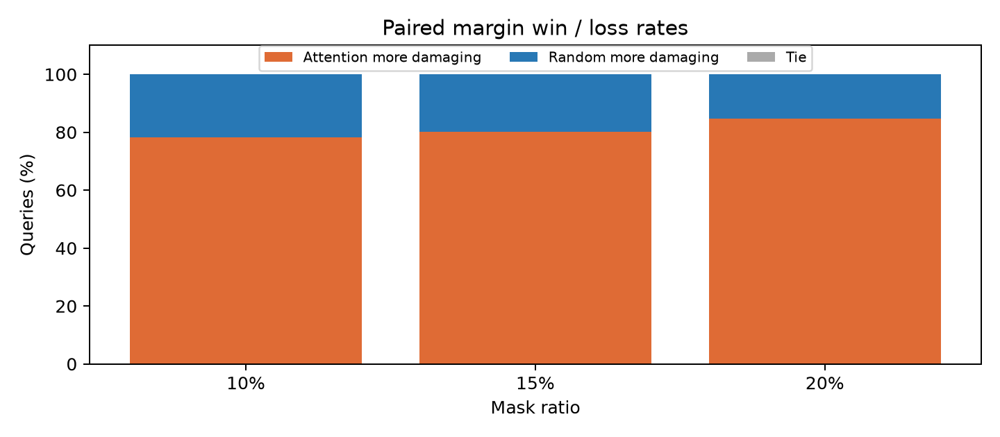
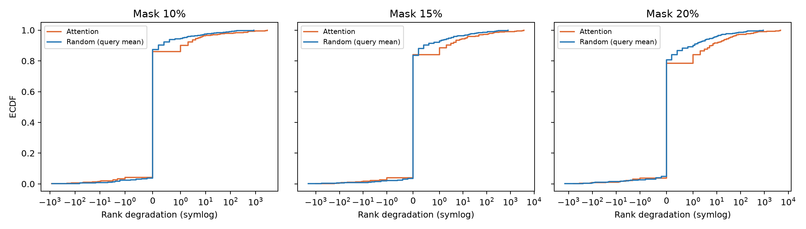

# Stage 1：现有 ablation500 配对统计

**H1 supported**（仅限本 checkpoint、数据子集与遮挡 protocol）。

Primary 15%：margin drop 的 attention − random_token 均值差为 **0.044645**，95% query-bootstrap CI **[0.040210, 0.049142]**；Cohen's dz=0.873，rank-biserial=0.807，attention win rate=80.2%。

15% 的 R@1：attention=79.40%，random_token=86.80%。failure flip：attention=11.20%，random_token=3.36%。

## 数据与统计约定

仅读取三份 CSV，没有加载模型、checkpoint、图片或 descriptor cache，没有执行 inference。逐项从 per_query.csv 重建并核对两个 paired 文件的八类 endpoint；每个合格 query 必须恰有 5 次 random placements。同一 mask construction 的 5 次 random 值先在 query 内平均；统计样本数为 query 数。

Bootstrap：固定 seed=2024，20,000 次有放回 query 重采样，均值差的 percentile 95% CI。CI 为逐项区间，不是 simultaneous CI；没有重采样 placement，也不刻画额外 placement 的 Monte Carlo 不确定性。同一 recall cohort 的四个 endpoint 共用重采样 query 索引。

Primary 固定 connected_topk / random_token / 10%、15%、20%，15% 为主要比例。两种检验均为双侧：Wilcoxon signed-rank 为主检验（asymptotic，zero_method=wilcox，不作连续性校正），配对 t-test 为均值差的补充检验。分别在三个比例内作 Holm 校正，不把两种检验当作独立复现。Wilcoxon 的位置差解释依赖差值分布对称性，不作为任意分布下的均值或中位数检验。

Cohen's dz = mean(D) / sample_std(D)，rank-biserial = (W+ − W−)/(W+ + W−)，后者剔除零差、绝对值 ties 用平均秩。仅 rank-test 和 win/loss 将差值四舍五入到小数点后 12 位；均值、CI、t-test、dz 使用原始差值。win/loss 分母包括 ties。常量非零差值的 dz 未定义，写为空值。

这些检验和 bootstrap 将 query 视为独立单位；同路线或近邻 query 的潜在相关性未作 cluster 校正。因此结果支持当前 intervention experiment 中的 attention proposal，不把 raw attention 称为 causal vulnerability 或 shortcut，也不外推到其他 checkpoint、数据集或遮挡方式。

证据标签采用透明的事后描述规则：三个 primary ratio 均为正且 mean CI 下界 > 0、Wilcoxon Holm p < 0.05 时为 supported；否则有正向均值时为 weak；其余为 unsupported。这不是预注册规则，secondary 和 protocol comparison 不用于升级标签。

## Primary margin endpoint

| mask_ratio | n_queries | mean_paired_difference | median_paired_difference | ci_low | ci_high | cohen_dz | rank_biserial | attention_win_rate | random_win_rate | tie_rate |
| --- | --- | --- | --- | --- | --- | --- | --- | --- | --- | --- |
| 0.1 | 500 | 0.0375866 | 0.0321318 | 0.0333752 | 0.0418305 | 0.773735 | 0.740551 | 0.782 | 0.218 | 0 |
| 0.15 | 500 | 0.044645 | 0.0399112 | 0.0402104 | 0.0491419 | 0.872686 | 0.806802 | 0.802 | 0.198 | 0 |
| 0.2 | 500 | 0.0511752 | 0.0448308 | 0.0464517 | 0.0559834 | 0.932622 | 0.852647 | 0.846 | 0.154 | 0 |

| mask_ratio | wilcoxon_p_raw | wilcoxon_p_holm | t_p_raw | t_p_holm |
| --- | --- | --- | --- | --- |
| 0.1 | 1.09863e-46 | 1.09863e-46 | 7.00441e-53 | 7.00441e-53 |
| 0.15 | 4.44478e-55 | 8.88955e-55 | 1.93555e-63 | 3.8711e-63 |
| 0.2 | 2.64809e-61 | 7.94426e-61 | 6.37905e-70 | 1.91372e-69 |

## Recall / failure flip

Recall damage advantage = random_token − attention；failure-flip advantage = attention − random_token。两者正数均代表 attention 更具破坏性。表中率和 CI 用 0–1 单位（乘 100 即百分点）。clean-R@1-correct 子集由未遮挡 clean rank 固定确定，不按 perturbation 结果筛选。

| mask_ratio | subset | metric | n_queries | attention_mean | random_token_mean | damage_advantage | ci_low | ci_high |
| --- | --- | --- | --- | --- | --- | --- | --- | --- |
| 0.1 | all_queries | hit_at_1 | 500 | 0.82 | 0.8764 | 0.0564 | 0.0336 | 0.08 |
| 0.1 | all_queries | hit_at_5 | 500 | 0.914 | 0.9364 | 0.0224 | 0.0076 | 0.0384 |
| 0.1 | all_queries | hit_at_10 | 500 | 0.932 | 0.9476 | 0.0156 | 0.004 | 0.0284 |
| 0.1 | all_queries | failure_flip | 500 | 0.088 | 0.024 | 0.064 | 0.0432 | 0.086 |
| 0.1 | clean_R1_correct | hit_at_1 | 446 | 0.901345 | 0.973094 | 0.0717489 | 0.0488677 | 0.0964126 |
| 0.1 | clean_R1_correct | hit_at_5 | 446 | 0.977578 | 0.996861 | 0.0192825 | 0.00672646 | 0.0336323 |
| 0.1 | clean_R1_correct | hit_at_10 | 446 | 0.988789 | 0.999103 | 0.0103139 | 0.00134529 | 0.0215247 |
| 0.1 | clean_R1_correct | failure_flip | 446 | 0.0986547 | 0.0269058 | 0.0717489 | 0.0488677 | 0.0964126 |
| 0.15 | all_queries | hit_at_1 | 500 | 0.794 | 0.868 | 0.074 | 0.0496 | 0.0992 |
| 0.15 | all_queries | hit_at_5 | 500 | 0.9 | 0.9316 | 0.0316 | 0.0156 | 0.0488 |
| 0.15 | all_queries | hit_at_10 | 500 | 0.918 | 0.9444 | 0.0264 | 0.012 | 0.04161 |
| 0.15 | all_queries | failure_flip | 500 | 0.112 | 0.0336 | 0.0784 | 0.056 | 0.102 |
| 0.15 | clean_R1_correct | hit_at_1 | 446 | 0.874439 | 0.962332 | 0.0878924 | 0.0627803 | 0.114798 |
| 0.15 | clean_R1_correct | hit_at_5 | 446 | 0.964126 | 0.99148 | 0.0273543 | 0.0125561 | 0.0434978 |
| 0.15 | clean_R1_correct | hit_at_10 | 446 | 0.977578 | 0.994619 | 0.0170404 | 0.00493274 | 0.0309417 |
| 0.15 | clean_R1_correct | failure_flip | 446 | 0.125561 | 0.0376682 | 0.0878924 | 0.0627803 | 0.114798 |
| 0.2 | all_queries | hit_at_1 | 500 | 0.754 | 0.8492 | 0.0952 | 0.0676 | 0.1232 |
| 0.2 | all_queries | hit_at_5 | 500 | 0.864 | 0.9244 | 0.0604 | 0.0396 | 0.0824 |
| 0.2 | all_queries | hit_at_10 | 500 | 0.894 | 0.9388 | 0.0448 | 0.0272 | 0.064 |
| 0.2 | all_queries | failure_flip | 500 | 0.158 | 0.0548 | 0.1032 | 0.0776 | 0.1292 |
| 0.2 | clean_R1_correct | hit_at_1 | 446 | 0.82287 | 0.938565 | 0.115695 | 0.0874439 | 0.145291 |
| 0.2 | clean_R1_correct | hit_at_5 | 446 | 0.926009 | 0.98565 | 0.0596413 | 0.038565 | 0.0820628 |
| 0.2 | clean_R1_correct | hit_at_10 | 446 | 0.952915 | 0.99148 | 0.038565 | 0.0219731 | 0.0569507 |
| 0.2 | clean_R1_correct | failure_flip | 446 | 0.17713 | 0.061435 | 0.115695 | 0.0874439 | 0.145291 |

## Secondary：仅两类比较

raw_topk 与自己的 random_token 在可平移 query 上配对；raw_topk 与 connected_topk 直接比较使用全部 query，包括无法平移的 raw mask。两者 token 与 pixel budget 均已核对一致。Secondary 的六个 contrast 按检验分别额外作 Holm 校正，仍属于 exploratory；完整检验结果见 secondary_statistics.csv。

| comparison | mask_ratio | n_queries | n_excluded | mean_paired_difference | ci_low | ci_high |
| --- | --- | --- | --- | --- | --- | --- |
| attention_raw_topk-minus-own-random_token | 0.1 | 498 | 2 | 0.0353219 | 0.031248 | 0.0393777 |
| attention_raw_topk-minus-attention_connected | 0.1 | 500 | 0 | -0.00119465 | -0.00281472 | 0.000454241 |
| attention_raw_topk-minus-own-random_token | 0.15 | 498 | 2 | 0.0441425 | 0.0398803 | 0.0484338 |
| attention_raw_topk-minus-attention_connected | 0.15 | 500 | 0 | 0.000311737 | -0.00109107 | 0.00169909 |
| attention_raw_topk-minus-own-random_token | 0.2 | 497 | 3 | 0.0482696 | 0.0437944 | 0.0527555 |
| attention_raw_topk-minus-attention_connected | 0.2 | 500 | 0 | -0.00107289 | -0.00239426 | 0.000257272 |

- raw − connected，10%：**no stable difference detected**。
- raw − connected，15%：**no stable difference detected**。
- raw − connected，20%：**no stable difference detected**。

CI 跨 0 仅表示 no stable difference detected，不能写成 proved equivalent；未做等效性检验。

## Protocol comparison（不属于 primary/secondary H1 证据）

以下为 query 内 random_token 均值 − random_pixel 均值的 margin drop。两者不仅 patch alignment 不同，sampling policy 也不同（token 在位置足够时不放回，pixel 放回），因此不能解释为纯粹的 patch-alignment causal effect。未对这些探索性 protocol p-values 作校正，也不据此作确认性结论。

| comparison | mask_ratio | n_queries | mean_paired_difference | ci_low | ci_high |
| --- | --- | --- | --- | --- | --- |
| connected_topk:random_token-minus-random_pixel | 0.1 | 500 | -0.00300497 | -0.00475423 | -0.00128749 |
| raw_topk:random_token-minus-random_pixel | 0.1 | 498 | -0.00399016 | -0.00567307 | -0.00230903 |
| connected_topk:random_token-minus-random_pixel | 0.15 | 500 | -0.00415319 | -0.0061454 | -0.00212677 |
| raw_topk:random_token-minus-random_pixel | 0.15 | 498 | -0.00642933 | -0.00835888 | -0.00452569 |
| connected_topk:random_token-minus-random_pixel | 0.2 | 500 | -0.00617353 | -0.00848443 | -0.00387515 |
| raw_topk:random_token-minus-random_pixel | 0.2 | 497 | -0.00505148 | -0.00727029 | -0.002857 |

## Rank 重尾描述

不报告 mean rank degradation 作为 headline。保留 ECDF、median (q50)、分位数和 catastrophic tail。Random 的 ECDF / 分位数 / tail 均基于每个 query 的 5 次 rank degradation 均值，tail 表示该 query 均值达到指定阈值的比例，不是单次 placement 的尾概率。

| mask_ratio | condition | n_queries | minimum | maximum | q25 | q50 | q75 | q90 | q95 | q99 | query_mean_degradation_ge_100 | query_mean_degradation_ge_1000 |
| --- | --- | --- | --- | --- | --- | --- | --- | --- | --- | --- | --- | --- |
| 0.1 | attention_connected | 500 | -841 | 2905 | 0 | 0 | 0 | 1 | 5.05 | 500.37 | 0.02 | 0.006 |
| 0.1 | random_token | 500 | -825.4 | 845.8 | 0 | 0 | 0 | 0.2 | 1.21 | 88 | 0.01 | 0 |
| 0.15 | attention_connected | 500 | -998 | 3680 | 0 | 0 | 0 | 2 | 14.05 | 571.38 | 0.028 | 0.01 |
| 0.15 | random_token | 500 | -2063.4 | 805.8 | 0 | 0 | 0 | 0.4 | 3.2 | 106.712 | 0.014 | 0 |
| 0.2 | attention_connected | 500 | -612 | 4663 | 0 | 0 | 0 | 6 | 33.15 | 546.89 | 0.028 | 0.01 |
| 0.2 | random_token | 500 | -1410.2 | 893 | 0 | 0 | 0 | 1 | 6.83 | 164.172 | 0.014 | 0 |

## 配对 cohort 与排除

| mask_ratio | mask_mode | baseline | n_total | n_paired | n_excluded |
| --- | --- | --- | --- | --- | --- |
| 0.1 | connected_topk | random_token | 500 | 500 | 0 |
| 0.1 | connected_topk | random_pixel | 500 | 500 | 0 |
| 0.1 | raw_topk | random_token | 500 | 498 | 2 |
| 0.1 | raw_topk | random_pixel | 500 | 498 | 2 |
| 0.15 | connected_topk | random_token | 500 | 500 | 0 |
| 0.15 | connected_topk | random_pixel | 500 | 500 | 0 |
| 0.15 | raw_topk | random_token | 500 | 498 | 2 |
| 0.15 | raw_topk | random_pixel | 500 | 498 | 2 |
| 0.2 | connected_topk | random_token | 500 | 500 | 0 |
| 0.2 | connected_topk | random_pixel | 500 | 500 | 0 |
| 0.2 | raw_topk | random_token | 500 | 497 | 3 |
| 0.2 | raw_topk | random_pixel | 500 | 497 | 3 |

## 可复现命令与输入校验

```bash
python scripts/analyze_stage1_results.py --input-dir outputs/stage1/ablation500 --output-dir outputs/stage1/statistics500 --seed 2024 --bootstrap-resamples 20000 --expected-queries 500 --tail-thresholds 100 1000
```

输入 SHA-256 和软件版本见 analysis_manifest.json；运行结束再次验证三份输入未改变。

- `per_query.csv`：`36379e791fa6cab7d6b0ecee454f7e4c5e086ba67e92a420a403b0761cb3babc`
- `paired_query.csv`：`6995e3b24b318f58242eb3422e29417f74ad74c711a5a9ec6842758fe976d0c6`
- `ablation_paired_query.csv`：`e28d25ad21043fd7ce7dc738ed7a1a2bddedee90a9ad816fade6c3b35ef0ff7b`

## 图表










